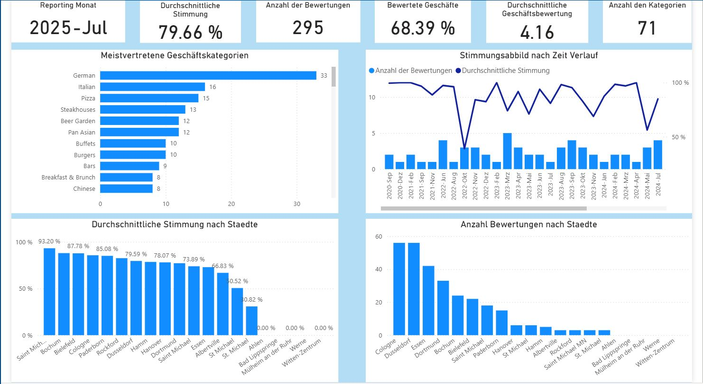

# Daten Analyse

Bei der Auswertung von Daten, insbesondere im Unternehmen, spielen Kennzahlen eine wichtige Rolle, denn sie werden für die Steuerung des operativen Geschäfts eingesetzt, und die diennen oft als Grundlage für daten getriebenen strategischen Entscheidungen. Daten Visualisierung ist eine gute Werkzeug, um Daten in unterschiedlicher Art un Weise einfach und geschickt darzustellen. Nur so können große Datenmenge von Stakeholdern, vor allen das Management, schnell Wahrgenommen, verstanden und interpretiert werden. In den vorherigen Komponenten dieser Extract-Load-Transform (ELT) Datenstrecke sind Daten aus Quellen schon extrahieriert, beladen und geziehlt transformiert, sodass sie für die Analyse einsatzbereit sind. In dieser Portfolio-Abschnitt werden die Daten basierend auf Kennzahlen ausgewertet und visuell dargestellt. Danach erfolgt eine Interpretation der Kennzahlen, um Schlüssfolgerungen zu ziehen.  

### Yelp Daten Analyse

Bei den Yelp Daten handelt es sich um Restaurants und ggf. ihre Bewertungen. Kunden sind nicht verpflichtet ein Restaurant nach Besuch abzugeben. Aus diesem Grund kann es durchaus kommen, dass ein Restaurant keine Bewertung bekommt. Für die Analyse werden folgende Kennzahlen in Power BI berechnet und visualisiert. Power BI ist eine gute BI Tool für tiefe Analyse und für den Aufbau interaktive Reports bzw. Dashboards.

**Berechnete Kennzahlen**

+ Anzahl der Bewertungen: Eine Bewertung ist eine Text, die ein Kunde beim Besuch oder nach Besuch eines Restaurants abgibt. Diese Text spiegelt die Meinung des Kundens Angesicht seine Erfahrung im Bezug auf dem Produkt oder Service des Restaurants wieder. Mehr Bewertungen zeigen eine höhe Engagement von den Kunden Seite an.
+ Durchschnittliche Stimmung: Diese wirde an Hand der Kunden Bewertungen abgebildet. Ein Wert von 0 heißt *schlechte Stimmung* und 1 dagegen heißt *sehr gute Stimmung*. Diese Kennzahl kann bei der Bestimmung von Schwach Stellen und Potenzialle unterstützen, denn die spiegelt die Meinung den Kunden gegenüber das Geschäft. Ob ein Kunde ein Restaurant weiter empfehlen kann, hängt stark von seine Stimmung ab. Deswegen ist diese Kennzahl für Geschäfte ebenfalls wichtig.
+ Anzahl der Geschäftskategorien: Für den betrachteten Datensatz ist diese die Anzahl der eindeutigen Geschäftkategorien, die in den Geschäften vertreten sind. Allderdings kann ein Restaurants mehrere Kategorien vertreten. Für Geschäfte ist es wichtig zu wissen, welche Kategorien von Marktkonkurente vertreten werden. Diese kann einen Einfluss auf die Preisgestaltung haben.
+ Durchschnittliche Geschäftsbewertug: Yelp bestimmt die Gesamt Bewertung eines Geschäfts. Ein Wert von 1 entsprich *schlecht* und 5 entspricht *sehr gut*. Dadurch können Geschäfte wissen, wie sie von Kunden Wahrgenommen werden. Die Kundenzufriedenheit kann mit dieser Kennzahl ebenfalls gemessen werden.
+ Bewertete Geschäfte: Basierend auf die auszuwertenden Daten ist diese den prozentuallen Anteil an bewerteten Geschäfte. Je mehr Bewertungen ein Geschäft bekommt, desto genauer kann ein Geschäft das Stimmungsbild seine Kunden ableiten. kunden können auch von den Bewertungen anderen Kunden profitieren. Dadurch können sie sich zuerst Informieren bevor sie sich für ein oder anderes Geschäft oder Restaurant entscheiden.
+ WortWolke: Zeigt die Worten, die in den Bewertungen häufig verwerdet worden.

Das nächste Bild zeigt eine visuelle Darstellung von den berechneten Kennzahlen, die oben beschrieben worden sind.

#### Intepretation

- Ungefähr *68 %* von den Restaurants im Daten haben mindestens eine Bewertung in 259 abgegebenen Bewertungen bekommen.
- Von den 71 Geschäftskategorien sind deutsche Cuisine am häufig vertreten. Was auch selbsverständlich ist, weil wir in Deutschland sind.
- Die durchschnittliche Stimmung liegt bei ungefähr 80%. Dh Die Kunden in den ausgewerteten Daten waren im Schnitt überwiegend sehr zufrieden mit den Produkten oder Service, die sie bei den Restaurants bekommen haben.
- Man sieht, dass Restaurants in große Staedte werden oft bewertet im Vergleich zu Restaurants in kleinere staedte. Z.b Die meisten Bewertungen sind in Cologne, Dusseldorf, Essen, und Dortmund abgegeben werden.
- Die neueste Bewertungen nach Zeit Verlauf zeigt eine mögliche Korrelation zwischen *Anzahl der Bewertungen und Stimmung*.  
- Im Schnitt haben Geschäfte eine Bewertung von 4. Diese wird auch von der durchschnittlichen Stimmung von 80% gut unterstützt.

#### Schlüssfolgerung

Es gibt ein großes Engagement in den Bewertung von Restaurants in große Staedte in NRW Deutschland. Diese Bewertungen spiegelt eine überwiegende positive Stimmung den Kunden, was für Restaurants in den Kategorien deutsche Cuisin, Gastropubs, Steakhaus und Beer Garden
durch ihre Produkte und Services eine sehr gute Kundenzufriedenheit schafft.

